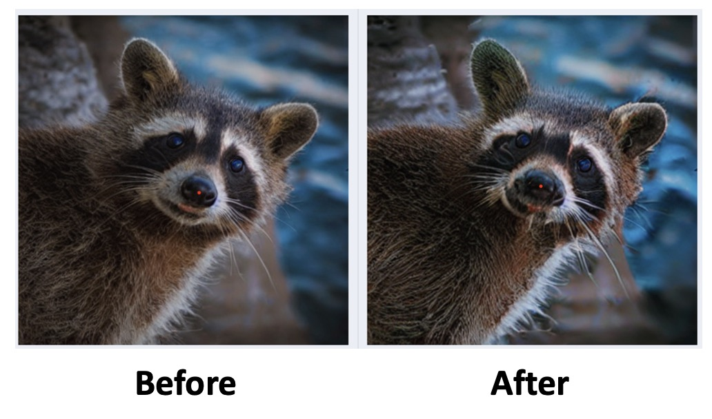

# DragDiffusion

This is an unofficial code for [**DragDiffusion**](https://arxiv.org/abs/2306.14435).

We show the DragDiffusion in a proof-of-concept way where we present the clean structured code of per-image optimization.

We hope the implementation of the principles helps.


The performances are not comparable with the paper's, and considering the performances, we do not include the GUI version yet.




## Environment
```
conda env create -f environment.yml
conda activate diff
```

## How-to
1. Put the image file in the `./finetune_data/` and finetune the SD-v1.5 with LoRA. 

    ```
    python dreambooth_lora.py --pretrained_model_name_or_path 'runwayml/stable-diffusion-v1-5' --instance_data_dir './finetune_data/' --instance_prompt 'xxy5syt00' --num_train_epochs 200 --checkpointing_steps 200 --output_dir 'lora-200'
    ```

2. Latent optimization.

    ```
    python run_drag.py
    ```

## Acknowledgement
* Developed based on [official version of DragGAN](https://github.com/XingangPan/DragGAN), [unofficial version of DragGAN](https://github.com/OpenGVLab/DragGAN), and [DIFT](https://github.com/Tsingularity/dift).